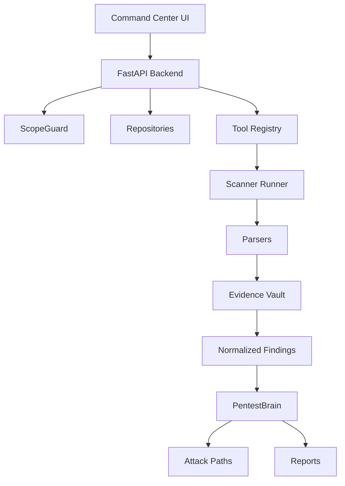

# Asura

[](LICENSE)
[](#roadmap)
[](backend/tests)

Asura is an open-source, self-hosted security command center that orchestrates trusted scanners, normalizes evidence, correlates attack paths, and generates remediation-focused reports for authorized security testing.

> **Status:** early development. Real scanner execution is the default — submit a scan from the Command Center and Asura runs the registered tool, persists the raw output to the evidence vault, invokes the parser, and writes normalized findings to the dashboard. Seeded demo content (the "Acme FlightOps" project) populates the UI out of the box so contributors can see the full flow before installing any scanners; `ASURA_DEMO_MODE=1` makes every subsequent scan return seeded output instead of spawning a real process.

## What Asura is

- A FastAPI backend + Next.js 15 dashboard you self-host.
- A registry-driven Arsenal of 94 tools (the 90 from the product spec plus four legacy/policy entries).
- Ten first-class core runners (Nmap, Nuclei, Semgrep, Trivy, Gitleaks, OSV-Scanner, Checkov, OWASP ZAP, Syft, Grype) with parser pipelines that normalize raw output into evidence-backed findings.
- A `PentestBrain` reasoning service that ranks, deduplicates, and correlates findings into attack-path hypotheses, **with every claim citing the evidence IDs that produced it**.
- A demo project — **Acme FlightOps Demo** — seeded with 10 findings and 3 attack-path hypotheses so the whole dashboard works the moment you start the stack.
- A safety contract enforced in code: scope guard, blocked-capability list, private-IP rule, lab-mode gate, high-risk tool gate, and an audit log of every scope decision.

## What Asura is not

Asura is not an unauthorized hacking tool, malware framework, phishing kit, DDoS tool, credential theft platform, persistence builder, or fake AI scanner. It refuses to ship the capabilities listed in [docs/SAFETY_MODEL.md](docs/SAFETY_MODEL.md).

## Quick start

```bash
git clone https://github.com/yourname/asura
cd asura
cp .env.example .env
docker compose up -d
```

Then open:

- Dashboard: <http://localhost:3000>
- API docs: <http://localhost:8000/docs>

See [QUICKSTART.md](QUICKSTART.md) and [INSTALL.md](INSTALL.md) for non-Docker setups.

## Running your first real scan

The fastest path is a passive Semgrep run against a local checkout:

```bash
# 1. Install semgrep (one-time)
pipx install semgrep

# 2. Start Asura
cp .env.example .env
docker compose up -d   # or: cd backend && uvicorn app.main:app &  cd frontend && npm run dev

# 3. Open http://localhost:3000, click "Run scan" on the Command Center.
#    Target: /path/to/a/local/repo
#    Scanners: semgrep
#    Mode: passive
#    Submit.
```

The dashboard refreshes; you'll see a new scanner run, evidence written to
`evidence/<workspace>/<project>/<scan_id>/semgrep.json` with a sha256
`content_hash`, and parsed findings appearing in the Findings page.

For the catalog of supported scanners + their install hints, see the
Arsenal page (`/arsenal`). **26 tools are wired end-to-end** today:

- **Core engines (10)**: nmap, nuclei, semgrep, trivy, gitleaks,
  osv-scanner, checkov, zap, syft, grype.
- **AppSec / language packs (10)**: bandit, pip-audit, npm-audit,
  cargo-audit, govulncheck, gosec, brakeman, eslint-security, bearer,
  trufflehog.
- **Recon (3 dedicated + 12 via shared discovery normalizer)**:
  subfinder, httpx, naabu have dedicated parsers; amass, dnsx, katana,
  gau, waybackurls, hakrawler, webanalyze, whatweb, wafw00f, tlsx,
  shuffledns, assetfinder share a generic discovery parser that emits
  one info-level finding per discovered host/URL/subdomain.
- **Generic SARIF**: CodeQL and any tool emitting SARIF v2.1.0 to stdout.

The remaining ~65 catalog entries are registered as
`integration_status: planned` until their parsers land — see the
roadmap.

## Seeded demo data

Out of the box Asura ships with the Acme FlightOps demo project so the dashboard isn't empty before you've run anything:

- Critical-severity leaked-secret finding, vulnerable npm dependency, missing-auth code path, exposed admin route, weak CORS, container vulnerability, overbroad IAM policy, missing security headers, old TLS, and an API endpoint with no rate limiting.
- Three correlated attack paths: **Potential account takeover chain**, **Container-to-service exposure chain**, **Cloud permission risk chain**.

Every seeded finding is flagged `is_demo_data: true` and the dashboard renders a "Demo mode" banner so it's always clear which data came from a real scan. Real runs you submit don't carry that flag; they appear alongside the seeded data and you can filter by `demo=true/false` on the Findings page. See [docs/DEMO_MODE.md](docs/DEMO_MODE.md) and [docs/SCANNER_RUNNERS.md](docs/SCANNER_RUNNERS.md).

If you'd rather keep the dashboard frozen on seeded content (useful for screenshots, demos, or air-gapped review), set `ASURA_DEMO_MODE=1` in the backend environment — every subsequent scan returns labelled seeded output instead of spawning a real process.

## Safety model

- Passive mode is the default. Active and lab scans require explicit authorization.
- The scope guard enforces project scope, private-IP rules, lab-mode preconditions, high-risk tool gating, and high-noise confirmations, then writes an `AuditLog` row for every decision.
- Blocked capabilities (malware, persistence, credential theft, phishing, ransomware, botnets, destructive payloads, stealth, unauthorized exploitation, data exfiltration, DDoS) are exposed at `GET /api/safety/blocked` and rendered on the `/safety` page.
- Every finding carries at least one `Evidence` record with a sha256 `content_hash`. Every PentestBrain claim cites the evidence IDs that produced it.

See [docs/SAFETY_MODEL.md](docs/SAFETY_MODEL.md).

## Architecture



- Frontend: Next.js 15 App Router, React 19, plain CSS dark theme, recharts, @xyflow/react for attack-path graphs.
- Backend: FastAPI + Pydantic 2.
- Persistence: in-memory `Repository[T]` per entity; SQL backend roadmapped.
- Scanners: 10 first-class runners; 80+ catalog entries for everything else.

See [docs/ARCHITECTURE.md](docs/ARCHITECTURE.md).

## UI pages

| Route | Purpose |
|-------|---------|
| `/` | Command Center: risk score, attack path, scanner health, findings table, full Arsenal. |
| `/projects` and `/projects/[id]` | Project list and detail (scope rules + targets). |
| `/scans` and `/scans/[id]` | Scanner runs history with args, exit code, demo badge. |
| `/findings` and `/findings/[id]` | Filterable findings table + Evidence Drawer. |
| `/attack-paths` and `/attack-paths/[id]` | Hypotheses with xyflow graph and next-validation panel. |
| `/arsenal` | All 94 tools, grouped by pack, with risk + mode + lab-only badges. |
| `/reports` | Markdown + JSON report downloads. |
| `/audit` | Audit log of scope decisions. |
| `/safety` | Blocked-capability list rendered from the API. |

## Adding a new scanner

1. Add an entry to `backend/registry/tools.yaml` with the contract fields.
2. If you want a runner, add a parser under `backend/app/services/parsers/`.
3. Register the parser in `app/services/parsers/__init__.py::PARSERS`.

See [docs/ADDING_A_TOOL.md](docs/ADDING_A_TOOL.md) and [docs/SCANNER_RUNNERS.md](docs/SCANNER_RUNNERS.md).

## Docs

- [Architecture](docs/ARCHITECTURE.md)
- [Safety Model](docs/SAFETY_MODEL.md)
- [Tool Registry](docs/TOOL_REGISTRY.md)
- [Arsenal](docs/ARSENAL.md)
- [Scanner Runners](docs/SCANNER_RUNNERS.md)
- [Evidence Vault](docs/EVIDENCE_VAULT.md)
- [PentestBrain](docs/PENTEST_BRAIN.md)
- [Reporting](docs/REPORTING.md)
- [Demo Mode](docs/DEMO_MODE.md)
- [Adding a Tool](docs/ADDING_A_TOOL.md)
- [Demo Flow](docs/DEMO_FLOW.md)
- [QA Checklist](docs/QA_CHECKLIST.md)

## Roadmap

These are the next 10 recommended development tasks, in priority order:

1. SQLAlchemy + Alembic + Postgres persistence behind the `Repository[T]` interface.
2. RQ worker for async scans with cancellation and concurrency limits.
3. JWT/SSO auth + multi-user workspaces and roles.
4. Wire runners + parsers for five high-value catalog tools (trufflehog, kube-bench, prowler, schemathesis, dalfox).
5. LLM-assisted summarization in PentestBrain (cited-evidence guard preserved).
6. SARIF import/export.
7. PDF report rendering.
8. CI workflow running pytest + lint + npm audit on PRs.
9. Signed reports and Merkle-proof immutable evidence references.
10. GitHub PR integration and scan-on-PR.

## Ethical use

Asura is for assets you own, lab environments, CTFs, training, bug-bounty engagements you are authorized to participate in, and defensive / blue-team work. Do not use it against systems you do not have written permission to test.
