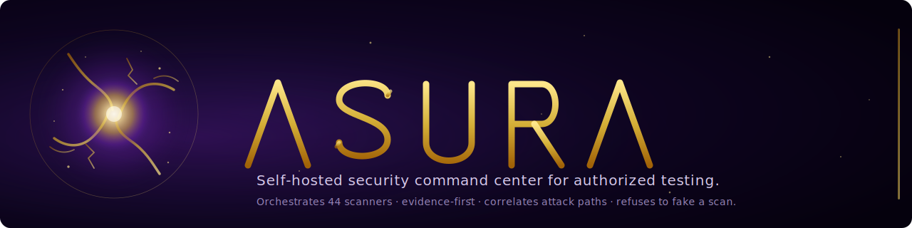

<div align="center">



# Asura

**Self-hosted security command center for authorized testing.**
Orchestrates 52 real scanners. Preserves evidence. Correlates attack paths. Refuses to pretend a scan happened.

[](LICENSE)
[](#roadmap)
[](backend/tests)
[](https://www.python.org/)
[](https://nextjs.org/)
[](#wired-scanners)
[](#persistence)

</div>

---

> **Stop running ten security tools and reading ten JSON files.**
> Asura runs the scanners, preserves the raw output with a content hash, deduplicates findings across tools, correlates them into attack-path hypotheses, and produces a report you can hand to a stakeholder.

```text
                 ┌───────────────────────────────────────────────────────┐
                 │                                                       │
   Authorized ──▶│   ScopeGuard ──▶ DemoRunner          │ JobQueue       │
   target /      │   (allow │ block) ──▶ SubprocessRunner│ (background    │
   scope         │                  ──▶ DockerRunner    │  threads + RQ) │
                 │                                                       │
                 │              ▼                                        │
                 │       Parsers (Nmap XML, Nuclei JSON, SARIF, …)       │
                 │              ▼                                        │
                 │       Evidence Vault (sha256, never overwrite)        │
                 │              ▼                                        │
                 │       Repositories (in-memory · SQLite · Postgres)    │
                 │              ▼                                        │
                 │       PentestBrain  ─▶  ranks · dedupes · correlates  │
                 │              ▼                                        │
                 │       Reports (Markdown + JSON, scope + safety stmt)  │
                 │                                                       │
                 └───────────────────────────────────────────────────────┘
```

## What it does

- **Runs real scanners** — 52 are wired end-to-end today across core engines, AppSec language packs, recon, fuzzers, K8s/cloud, API testing, and SARIF importers. The other ~42 are registered in the catalog with truthful state (`planned` / `reference` / `analyzer` / `importer` / `blocked`).
- **Zero local install needed** — most wired tools ship with canonical Docker images. If a binary isn't on PATH, Asura runs `docker run --rm <image>` automatically. Set `ASURA_PREFER_DOCKER=1` to always prefer the container path.
- **Background jobs + pipelines** — `POST /api/scans/async` returns immediately with a job id; poll `/api/jobs/{id}` for progress. Three preset pipelines (`passive-recon`, `code-audit`, `container-audit`) chain multiple scanners with optional asset-passing between stages.
- **Evidence-first** — every finding carries at least one `Evidence` record with a sha256 content hash and the exact argv used. Raw payloads land at `evidence/<workspace>/<project>/<scan_id>/<tool>.json` and are never overwritten.
- **Scope-gated** — the safety guard rejects scans against private IPs without `owned_internal=True`, requires explicit authorization for active/lab modes, blocks high-risk tools outside lab mode, and writes one `AuditLog` row per decision (allow or block).
- **Deterministic reasoning** — `PentestBrain` ranks, deduplicates by fingerprint, correlates findings into attack-path hypotheses, and generates remediation plans. **Every claim cites the evidence IDs that produced it** — no hallucinated vulns.
- **Optional LLM-assisted triage** — configure an Anthropic API key on `/settings/llm` (Fernet-encrypted at rest, never returned by the API) or set `ASURA_LLM_TRIAGE=1` + `ANTHROPIC_API_KEY` for headless deployments. Routes the ranked finding list through Claude for clustering and false-positive scoring. The citation guard discards any LLM output that references evidence ids the brain never handed it, so hallucinated findings can't leak into the response. The deterministic baseline still ships as the default.
- **Persistence built-in** — flip `ASURA_USE_SQL=1` for SQLite or Postgres. Projects, scans, findings, evidence, runs, audit logs, jobs, and remediations survive restarts behind the same Repository interface tests already use.
- **Authenticated scanning** — Fernet-encrypted auth profiles (bearer / basic / header / cookie) are injected into Nuclei + HTTPx + ZAP at runtime; for ZAP, Asura generates a per-scan `--hook` script that wires Replacer rules at daemon-startup and wipes itself after the scan. Custom Nuclei templates uploaded through the UI are content-hashed and stored on disk.
- **Reports you can hand to a stakeholder** — Markdown + JSON with engagement summary, scope statement, authorization statement, methodology, tools used, executive summary, risk overview, attack paths, findings by severity, evidence references, remediation roadmap, and a safety statement.

## What it is *not*

Asura is not an unauthorized hacking tool, malware framework, phishing kit, credential stealer, ransomware builder, or fake AI scanner. The blocked-capability list is enforced in code and exposed at `GET /api/safety/blocked`. The default scanner mode is passive; active and lab modes require explicit per-scan authorization.

## Use cases

| You want to… | Asura does it via |
|--------------|-------------------|
| Audit your own repo for code issues, leaked secrets, vulnerable deps, and IaC misconfigs in one pass | The `code-audit` pipeline: Semgrep + Gitleaks + OSV-Scanner running in parallel against the repo, results normalized into one Findings view. |
| Scan a container image without manually running 4 different tools | The `container-audit` pipeline: Syft (SBOM) → Grype (vulns) + Trivy (vulns + misconfig + secrets). |
| Do passive recon on an authorized scope | The `passive-recon` pipeline: Subfinder → HTTPx (probes each discovered subdomain). Asset chaining is automatic. |
| Run a long scan without blocking your browser tab | "Run in background" on the Run-scan form (or `POST /api/scans/async`). Tracks progress at `/jobs/{id}`. |
| Use Asura on a fresh machine without installing 50+ binaries | Install Docker. Asura's runner auto-falls-back to the registered image for every wired scanner. |
| Scan past a login / behind a bearer token | Save an auth profile under `/auth-profiles`; pick it from the Run-scan form. Credentials never leave disk in plaintext. |
| Hand a customer a deliverable | `POST /api/reports/{project_id}` returns Markdown + JSON with 14 sections including a scope + authorization + safety statement. |
| Prove every claim about a finding is grounded in real data | Every `Finding.evidence[i]` carries a sha256 `content_hash` of the raw scanner output; every `PentestBrain` claim returns `cited_evidence_ids`. |

## Install

```bash
git clone https://github.com/AaronGrillot98/Asura
cd Asura
cp .env.example .env
docker compose up -d
```

Or run the dev stack directly without Docker:

```bash
# terminal 1 — backend
cd backend
pip install -r requirements.txt
python -m uvicorn app.main:app --reload --host 127.0.0.1 --port 8000

# terminal 2 — frontend
cd frontend
npm install
npm run dev
```

Open <http://localhost:3000>. Backend at <http://localhost:8000/docs>.

## Your first real scan

```bash
# Option A — install one scanner locally
pipx install semgrep

# Option B — don't install anything; Asura will auto-run scanners in Docker
# (most of the wired 44 have canonical images registered)
```

Then on the dashboard:

1. Click **Run scan** (top right of the Command Center).
2. Target: `/path/to/your/repo` for code, or `https://your.authorized.target` for web.
3. Pick a scanner — `semgrep` is a good first run.
4. Mode: `passive`.
5. **Submit**.

The Command Center refreshes. The scan run appears under `/scans` with a message ending in *"via local binary …"* or *"via Docker image …"* so you know exactly which execution path ran. New findings appear under `/findings`. The raw payload lands on disk at `evidence/…/<tool>.json` with a sha256 content hash.

For long scans, check **Run in background** on the form. The job is queued, you get a job id, and you can poll progress at `/jobs/{id}`.

## Pipelines

Pipelines are named chains of scanner stages. Three ship today:

| ID | Stages | Risk |
|----|--------|------|
| `passive-recon` | subfinder → httpx (probes discovered subdomains) | low |
| `code-audit` | Semgrep · Gitleaks · OSV-Scanner | low |
| `container-audit` | Syft → Grype + Trivy | low |

Run one from the `/pipelines` page or:

```bash
curl -X POST http://localhost:8000/api/pipelines/run \
  -H 'Content-Type: application/json' \
  -d '{"project_id":"demo","pipeline_id":"code-audit","target":"/path/to/repo"}'
```

The response contains a `job_id`. Poll `/api/jobs/{job_id}` for progress.

## Dashboard tour

19 routes ship today, all behind the same dark purple/gold theme:

| Route | What you see |
|-------|--------------|
| `/` | Command Center: hero metrics, risk trend chart, coverage-by-domain grid, most-dangerous attack path, "fix these first", scanner health, brain reasoning, top findings, quick links. |
| `/projects` · `/projects/{id}` · `/projects/new` | Workspace projects with status dots; wizard for scope rules + grantor; per-project dashboard with inline targets editor + Run scan + Delete. |
| `/scans` · `/scans/{id}` | Scanner run history with status, args, exit code, evidence link, scope decision. |
| `/jobs` · `/jobs/{id}` | Background job queue with status, progress %, runs produced, findings created. |
| `/pipelines` | Preset chains with "Run pipeline" forms inline. |
| `/findings` · `/findings/{id}` | Filterable table; Evidence Drawer with raw JSON, content hash, command metadata. |
| `/attack-paths` · `/attack-paths/{id}` | xyflow graph of nodes/edges + remediation roadmap. |
| `/arsenal` | Catalog of 94 registered tools with status dots, install badges, lab-only markers. |
| `/templates` | Custom Nuclei template upload + content-hashed registry. |
| `/auth-profiles` | Fernet-encrypted credentials for authenticated scanning (bearer / basic / header / cookie). |
| `/audit` | Every scope decision (allow / block) with timestamp + reason. |
| `/safety` | The blocked-capability list — pulled live from `/api/safety/blocked`. |
| `/reports` | Markdown + JSON report downloads. |

Press **`/`** anywhere to open the global search palette (also `Ctrl/Cmd+K`). Search across projects, findings, tools, scanner runs, and attack paths.

## Wired scanners

| Pack | Tools |
|------|-------|
| Core engines (10) | nmap · nuclei · semgrep · trivy · gitleaks · osv-scanner · checkov · zap · syft · grype |
| AppSec / language (10) | bandit · pip-audit · npm-audit · cargo-audit · govulncheck · gosec · brakeman · eslint-security · bearer · trufflehog |
| Recon — dedicated (3) | subfinder · httpx · naabu |
| Recon — shared discovery (12) | amass · dnsx · katana · gau · waybackurls · hakrawler · webanalyze · whatweb · wafw00f · tlsx · shuffledns · assetfinder |
| Web fuzzers + DAST (7) | ffuf · gobuster · dirsearch · sqlmap · feroxbuster · nikto · wapiti |
| Dependency / SCA (1) | retirejs |
| API testing (2) | schemathesis · jwt-tool |
| K8s / cloud (5) | kube-bench · kube-score · kubescape · prowler · polaris |
| Container benchmark (1) | docker-bench-security |
| Importers (1) | SARIF (CodeQL + any SARIF-emitting tool) |

**52 wired, 94 in the catalog.** The remaining ~42 are visible under `/arsenal` with truthful state (`planned` / `reference` / `analyzer` / `importer` / `blocked`) — intentionally not runnable until their parsers land.

## Safety model

- **Scan modes**: `passive` (default — non-invasive), `active` (authorized scope + explicit confirmation), `lab` (intentionally vulnerable targets only).
- **Scope guard** runs before every scanner. Blocks: target out of scope, private IPs without `owned_internal=True`, active scans without explicit authorization, high-risk tools outside lab mode, blocked-capability tools (period).
- **Blocked capabilities** (refused outright, exposed at `/api/safety/blocked` and `/safety`): malware, persistence, credential theft, phishing, ransomware, botnets, destructive payloads, stealth, unauthorized exploitation, data exfiltration, DDoS.
- **Audit log**: every scope decision (allow or block) writes a row with timestamp + actor + reason + payload. Visible at `/audit`.
- **No fake scan claims**: `is_demo_data: true` flows from the storage layer to the UI banner. Real subprocess runs never produce the demo flag.

See [docs/SAFETY_MODEL.md](docs/SAFETY_MODEL.md) for the complete contract.

## Architecture

```text
frontend/  Next.js 15 (App Router) · React 19 · @xyflow/react · recharts
           Purple/black/gold theme, sidebar with section labels, command palette (/)

backend/   FastAPI · Pydantic 2 · SQLAlchemy 2 · Python 3.11+
           app/
             api/routes.py            HTTP surface
             models/schemas.py        Domain models (Pydantic)
             db/                      SQLAlchemy engine, ORM rows, init_db()
             repositories/            Repository[T] — in-memory + SQL impls
             security/                ScopeGuard, BLOCKED_CAPABILITIES, private-network gate
             services/
               runner.py              Decision tree: demo / docker / local subprocess
               parsers/               Per-tool output normalizers
               evidence_store.py      sha256 content hashing
               fingerprint.py         Finding dedupe
               pentest_brain.py       Evidence-grounded reasoning
               job_queue.py           Inline-thread queue (RQ opt-in)
               job_runner.py          Single-scan + multi-stage pipeline callbacks
               pipelines.py           Preset pipeline registry
               templates_service.py   Custom Nuclei template registry
               auth_profile_service.py Fernet-encrypted credential store
               reporting.py           Markdown + JSON report builder

evidence/  Raw scanner output, content-hashed, never overwritten
templates/ Custom Nuclei templates with sha256 verification
auth/      Fernet-encrypted auth profiles (never logged in cleartext)
reports/   Generated reports
```

Documentation index:

- [Architecture](docs/ARCHITECTURE.md)
- [Safety model](docs/SAFETY_MODEL.md)
- [Tool registry](docs/TOOL_REGISTRY.md)
- [Arsenal](docs/ARSENAL.md)
- [Scanner runners](docs/SCANNER_RUNNERS.md) — three execution paths (demo / local / Docker)
- [Evidence vault](docs/EVIDENCE_VAULT.md)
- [PentestBrain](docs/PENTEST_BRAIN.md)
- [Reporting](docs/REPORTING.md)
- [Demo mode](docs/DEMO_MODE.md)
- [QA checklist](docs/QA_CHECKLIST.md)

## Persistence

By default Asura uses an in-memory store seeded from `demo_store` on each
restart. To persist projects, scans, findings, evidence, and audit logs
across restarts:

```bash
# SQLite (zero-config, file at ./asura.db)
export ASURA_USE_SQL=1

# Or Postgres (real production)
export ASURA_USE_SQL=1
export DATABASE_URL=postgresql+psycopg://asura:asura@db:5432/asura
```

Tables are created automatically on first boot. The seed only runs when
the demo project is missing, so restarts are idempotent. Templates and
auth profiles keep their own encrypted file-system storage independent of
this toggle (see `templates/` and `auth/`).

The schema uses an indexed-column + JSON-payload pattern so new
optional Pydantic fields don't need a migration — they live inside the
JSON column. When you start indexing on a new field, Alembic takes
over: set `ASURA_USE_ALEMBIC=1` to make `init_db()` run
`alembic upgrade head` instead of `create_all`, or run the CLI:

```bash
cd backend
py scripts/migrate.py upgrade       # upgrade to head
py scripts/migrate.py current       # show recorded revision
py scripts/migrate.py history       # show full revision history
```

See [docs/MIGRATIONS.md](docs/MIGRATIONS.md) for revision authoring and
the create_all-vs-Alembic parity contract.

## Roadmap

Active development. Next moves, in priority order:

1. **Burp / mitmproxy traffic ingestion** — browse with the proxy, automatically build a target inventory.
2. **SARIF import/export everywhere** — CI integration becomes one HTTP POST.
3. **PDF report rendering**.
4. **CI workflow** (GitHub Actions) running pytest + lint + npm audit on PRs.
5. **Signed reports + Merkle-proof immutable evidence references**.
6. **Multi-user workspaces + JWT/SSO auth** — Asura's own access control.

## Contributing

Tested with Python 3.11 / 3.13 and Node 20+. Tests are pytest (backend) and the standard Next.js stack (frontend).

```bash
# backend
cd backend && python -m pytest -q

# frontend
cd frontend && npm run lint && npm run build
```

PRs welcome — see [docs/ADDING_A_TOOL.md](docs/ADDING_A_TOOL.md) for the contract a new scanner needs to satisfy.

## Ethical use

Asura is for assets you own, lab environments, CTFs, training, bug-bounty engagements you are authorized to participate in, and defensive / blue-team work. Active scanning without authorization is illegal in most jurisdictions. Use this only against systems you have written permission to test.

## License

[MIT](LICENSE)
