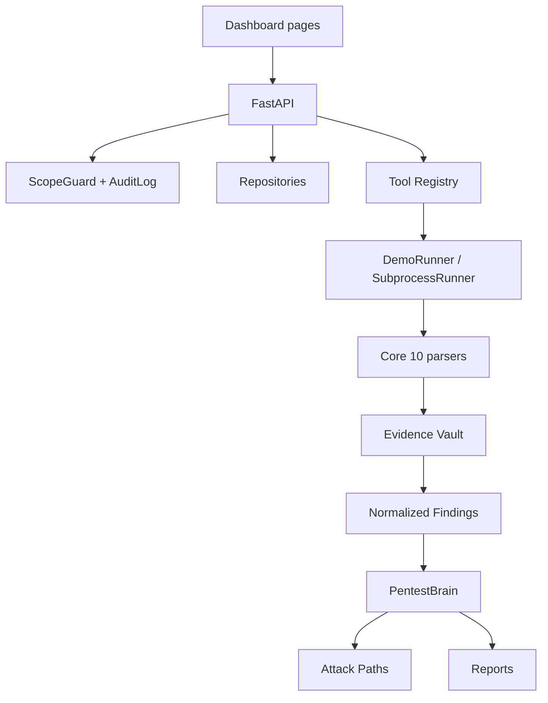

# Architecture

Asura is organized around six layers:

1. **Frontend dashboard** — Next.js 15 App Router, React 19, plain CSS dark
   theme, recharts, @xyflow/react. Pages: Command Center, Projects, Scans,
   Findings, Attack Paths, Arsenal, Reports, Audit, Safety.
2. **Backend API** — FastAPI + Pydantic 2. Routes live in
   `backend/app/api/routes.py` and are repo-backed.
3. **Repository layer** — `Repository[T]` protocol with an in-memory
   implementation per entity (projects, findings, evidence, runs, attack
   paths, audit, reports, targets, scopes, remediations, schedules,
   workspaces). A SQL backend can implement the same protocol later.
4. **Tool registry + runner** — `backend/registry/tools.yaml` is validated
   on load. The runner ships two implementations: `DemoRunner` (default,
   never spawns a subprocess) and `SubprocessRunner` (opt-in via
   `ASURA_ENABLE_REAL_SCANNERS=1`).
5. **Parsers + evidence vault** — one parser per core runner under
   `backend/app/services/parsers/`. Raw payloads are persisted with a
   sha256 `content_hash`; see [EVIDENCE_VAULT.md](EVIDENCE_VAULT.md).
6. **Reasoning layer (PentestBrain)** — single service exposing the eight
   functions from the product spec. Pure-Python deterministic correlator
   today; every claim cites the evidence IDs that produced it. See
   [PENTEST_BRAIN.md](PENTEST_BRAIN.md).



## Module map

```
backend/app/
├── api/routes.py                      # FastAPI routes (repo-backed)
├── models/schemas.py                  # Pydantic models
├── repositories/                      # In-memory Repository[T]
│   ├── base.py
│   └── seed.py                        # demo seed loader
├── security/
│   ├── scope_guard.py                 # decide_scope() + back-compat helper
│   ├── private_networks.py
│   └── blocked_capabilities.py
├── services/
│   ├── demo_store.py                  # Acme FlightOps demo seed
│   ├── runner.py                      # DemoRunner / SubprocessRunner
│   ├── evidence_store.py              # content hashing + never-overwrite
│   ├── fingerprint.py                 # Finding dedupe
│   ├── pentest_brain.py               # The 8-function reasoning service
│   ├── reporting.py                   # Markdown + JSON report builders
│   ├── scanner_registry.py            # Core 10 engine wiring
│   ├── tool_registry.py               # tools.yaml contract validation
│   └── parsers/                       # nmap, nuclei, semgrep, ..., grype
└── agents/__init__.py                 # legacy back-compat shim
```

## Demo data flow

1. `app.repositories.get_repos()` lazily seeds itself from
   `app.services.demo_store`.
2. The Command Center calls `GET /api/dashboard/demo`, which pulls findings,
   runs, paths, and a live PentestBrain `correlate_findings` summary.
3. Demo findings carry `is_demo_data: true`, which propagates to the
   dashboard banner, reports, and the `/audit` event payload.
